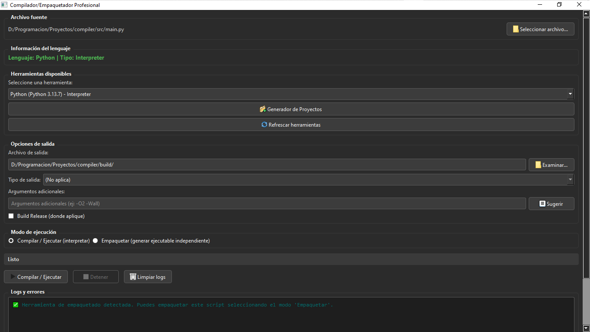
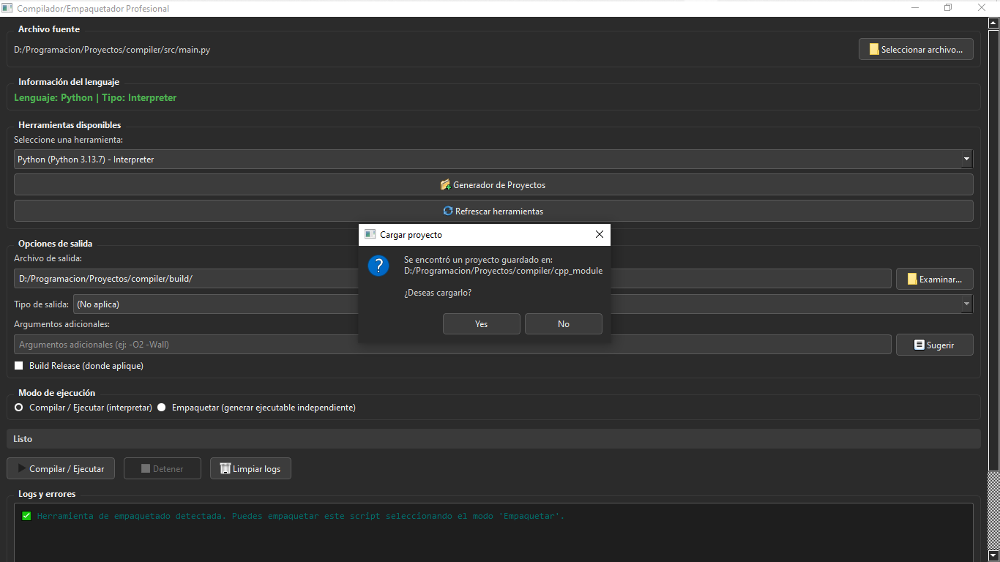
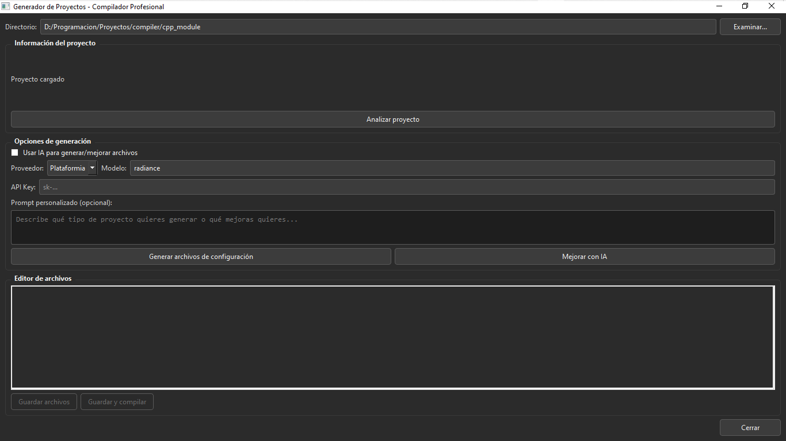
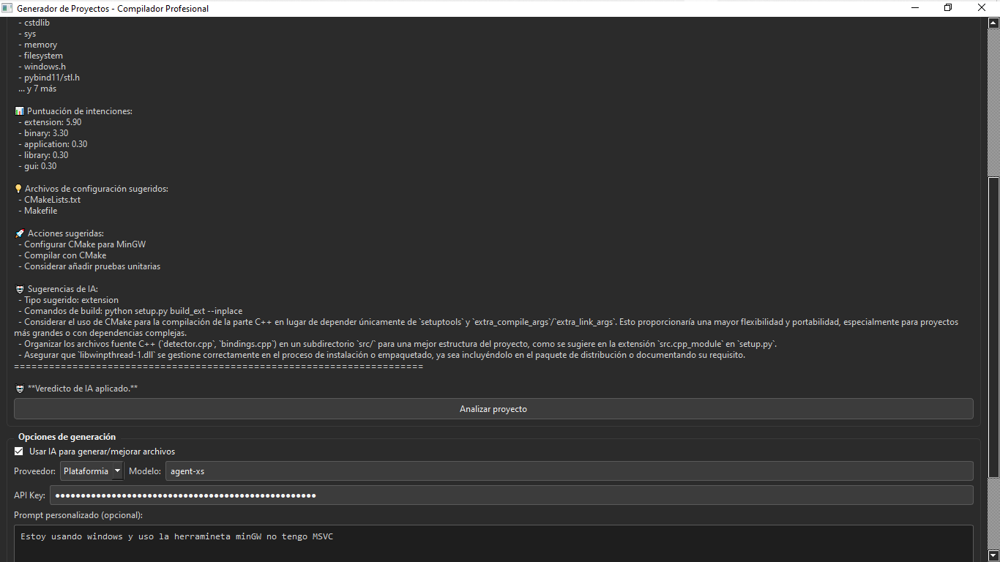

# ⚙️ Compilador/Empacador Profesional

[](https://github.com/bryangarcia1204/compiler/actions/workflows/ci.yml)
[](https://github.com/bryangarcia1204/compiler/releases)
[](https://codecov.io/gh/bryangarcia1204/compiler)
[](https://opensource.org/licenses/MIT)
[](https://www.python.org/downloads/)
[](https://github.com/bryangarcia1204/compiler)

> **Aplicación de escritorio y CLI** que detecta automáticamente compiladores, intérpretes y empaquetadores instalados en tu sistema, permitiéndote compilar o empaquetar archivos fuente en múltiples formatos con solo unos clics.(Todavía está en desarrollo)

---

## 🚀 Características

- ✅ **Detección automática** de compiladores e intérpretes (GCC, Clang, Rust, Go, Java, Python, Node.js, .NET, etc.).
- ✅ **Soporte multiplataforma** – funciona en Windows, Linux y macOS.
- ✅ **Interfaz gráfica moderna** (PyQt5) con modo oscuro y experiencia intuitiva.
- ✅ **Interfaz de línea de comandos (CLI)** para automatizar builds en scripts.
- ✅ **Múltiples tipos de salida**: ejecutables, bibliotecas dinámicas/estáticas, objetos, WASM, JAR, wheels, etc.
- ✅ **Arquitectura modular y extensible**: añade nuevos lenguajes y herramientas mediante **plugins** sin tocar el código base.
- ✅ **Parsing de errores** con mensajes claros y coloreados.
- ✅ **Sugerencias de argumentos** para cada herramienta.
- ✅ **Módulo C++ de alto rendimiento** para la detección rápida de compiladores.
- ✅ **Generador de proyectos con IA**: analiza tu proyecto, detecta su estructura y genera automáticamente los archivos de configuración (Makefiles, Cargo.toml, pyproject.toml, etc.).
- ✅ **Mejora de archivos con IA**: mejora y completa archivos de configuración existentes usando IA local o en la nube.
- ✅ **Persistencia de proyectos**: guarda el estado del análisis y los archivos generados para retomar el trabajo en cualquier momento.
- ✅ **Soporte para modelos locales**: integración con TinyLlama para usar IA sin conexión.

---

## 🖼️ Captura de pantalla









.png")

.png")

---

## 📦 Instalación

### Requisitos previos

- **Python 3.8 o superior**
- **Compilador C++** con soporte para C++11 (GCC, Clang o MSVC).
- **CMake** (opcional, solo si se compila el módulo C++ manualmente).

### Instalación desde PyPI (próximamente)
```bash

# Clonar el repositorio
git clone https://github.com/bryangarcia1204/compiler.git
cd compiler

# Crear y activar un entorno virtual (recomendado)
python -m venv venv
source venv/bin/activate   # Linux/macOS
# venv\Scripts\activate    # Windows

# Instalar el paquete en modo editable
pip install -e . --no-build-isolation

* Nota: `--no-build-isolation` evita conflictos con el módulo C++ durante el desarrollo.
```
## Compilación del módulo C++

El módulo C++ se compila automáticamente durante la instalación con `pip install -e .`.
Si deseas compilarlo manualmente (por ejemplo, para depuración):
```bash
python setup.py build_ext --inplace
```
En Windows, asegúrate de tener **MinGW** o **MSVC** configurado correctamente.

## 🧠 Uso Interfaz Gráfica (GUI)
```bash
compilador
```
O, si estás en el directorio del proyecto:
```bash
python -m src.main
```
***Pasos básicos***:

1. Selecciona un archivo fuente.

2. Elige la herramienta deseada (se autodetecta).

3. Configura el tipo de salida y argumentos adicionales.

4. Haz clic en **Compilar / Ejecutar** o **Empaquetar**.

***Generador de Proyectos***:

* Abre el generador desde el botón "Generador de Proyectos" en la GUI.

* Selecciona un directorio y haz clic en "Analizar proyecto".

* Activa la IA para obtener un veredicto y sugerencias personalizadas.

* Genera archivos de configuración automáticamente.

* Si ya tienes archivos de configuración, puedes mejorarlos con IA.
#
# Interfaz de Línea de Comandos (CLI)

El proyecto incluye una CLI completa para automatizar tareas.
## Listar herramientas detectadas
```bash

compilador-cli list-tools
```
## Analizar un proyecto
```bash

# Análisis básico
compilador-cli analyze ./mi_proyecto

# Análisis con IA (usando TinyLlama local)
compilador-cli analyze ./mi_proyecto --ai --provider tinyllama

# Guardar el análisis en JSON
compilador-cli analyze ./mi_proyecto --ai --output analysis.json
```
## Generar archivos de configuración
```bash

# Generar archivos estándar
compilador-cli generate ./mi_proyecto

# Generar con IA y prompt personalizado
compilador-cli generate ./mi_proyecto --ai --prompt "Generar Makefile y CMakeLists.txt"
```
## Mejorar archivos existentes con IA
```bash

# Mejorar archivos de configuración
compilador-cli enhance ./mi_proyecto --ai --prompt "Mejorar Makefile con optimizaciones"
```
## Compilar un archivo
```bash

# Compilar con autodetección
compilador-cli compile hola.c

# Compilar con herramienta específica y modo release
compilador-cli compile hola.c --tool gcc --release -o hola.exe

# Compilar una biblioteca dinámica (DLL en Windows)
compilador-cli compile hola.c --type dll -o hola.dll

# Compilar con argumentos adicionales
compilador-cli compile hola.cpp --args "-std=c++17 -Wall"
```
## Empaquetar un archivo

```bash
# Empaquetar un script Python con PyInstaller
compilador-cli package script.py --output dist/mi_app

# Empaquetar un archivo JavaScript con pkg
compilador-cli package app.js --tool pkg
```
#### Tipos de salida soportados (``--type``):
``exe``, ``bin``, ``dll``, ``so``, ``dylib``, ``a``, ``lib``, ``obj``, ``pyd``, ``whl``, ``jar``, ``wasm``, etc.
Consulta la lista completa en output_types.py.
# 
# 🧩 Extensibilidad: Añadir nuevos lenguajes (Plugins)

El motor de compilación está diseñado para ser extensible sin modificar el código base.

1. Crea un archivo Python en `src/compilers/plugins/`, por ejemplo `mylang.py`.

2. Define una clase que herede de `CompilerStrategy` e implementa los métodos requeridos.

3. Exporta `STRATEGY_CLASS = MiClaseStrategy`.

## Ejemplo mínimo para un compilador ficticio "MiLang":


``` python
# src/compilers/plugins/mylang.py
from ..base import CompilerStrategy

class MiLangStrategy(CompilerStrategy):
    @property
    def tool_name(self):
        return 'milang'

    @property
    def supported_extensions(self):
        return ['.ml']

    def build_command(self, file_path, output_path=None, extra_args=None,
                      output_type='exe', release_mode=False):
        extra_args = extra_args or []
        cmd = ['milang', 'build']
        if output_path:
            cmd.extend(['-o', output_path])
        if release_mode:
            cmd.append('--release')
        if extra_args:
            cmd.extend(extra_args)
        cmd.append(file_path)
        return cmd, None, []

STRATEGY_CLASS = MiLangStrategy
```

¡Así de simple! No necesitas modificar `compilation_engine.py` ni ningún otro archivo.

# 🤖 Soporte para IA

El proyecto incluye soporte para IA (local y en la nube) para analizar proyectos y generar/mejorar archivos de configuración.

**Proveedores compatibles**
|Proveedor|	Tipo| Requiere API Key| Notas|
|---------|-----|------------------|------|
|PlataformIA|	Nube|	Sí|	Servicio local (Cuba)|
|DeepSeek|	Nube|	Sí|	Modelo deepseek-coder|
|OpenAI|	Nube|	Sí|	Modelos GPT|
|Groq|	Nube|	Sí|	Modelos open source rápidos|
|Qwen2.5|	Local|	No|	Coder-1.5B-Instruct (o el q desees)|


## Configuración de IA

Para usar IA, necesitas configurar tu API key (para servicios en la nube) o descargar el modelo TinyLlama.

#### **Qwen** (local, gratuito):

* Descarga el modelo desde Hugging Face.

* Coloca el archivo ``qwen2.5-Coder-1.5B-Instruct.Q4_K_M.gguf`` en ``models/``.

* Instala ``llama-cpp-python``:

```bash
pip install llama-cpp-python
```

#### **API Key**: Configura las variables de entorno en un archivo ``.env``:
```env

PLATAFORMIA_API_KEY=tu_clave
DEEPSEEK_API_KEY=tu_clave
OPENAI_API_KEY=tu_clave
GROQ_API_KEY=tu_clave
QWEN_PATH=./models/qwen2.5-coder-1.5B-instruct.q4_k_m.gguf
```

# 🧪 Tests

El proyecto incluye un amplio conjunto de pruebas unitarias y de integración.
```bash

# Ejecutar todas las pruebas
pytest tests/ -v

# Ejecutar con cobertura
pytest tests/ --cov=src --cov-report=html

# Ejecutar pruebas específicas
pytest tests/test_compilation_engine.py -v
```

Las pruebas se ejecutan automáticamente en **GitHub Actions** para Windows, Linux y macOS.
#
### 🤝 Contribución

¡Las contribuciones son bienvenidas!
Puedes ayudar de las siguientes maneras:

* Reportando errores o sugerencias en Issues.

* Añadiendo soporte para nuevas herramientas o lenguajes.

* Mejorando la documentación.

* Refactorizando o mejorando el rendimiento.

Guía rápida:

1. Haz un fork del repositorio.

2. Crea una rama para tu feature (`git checkout -b feature/nueva-herramienta`).

3. Realiza los cambios y añade pruebas.

4. Asegúrate de que todas las pruebas pasen.

5. Envía un Pull Request describiendo tus cambios.
#

### 📄 Licencia

Este proyecto está bajo la **Licencia MIT**.
Consulta el archivo LICENSE para más detalles.

#

###📬 Contacto

* **Autor**: Brayan M.

* **Email**: bgarciaguibert@gmail.com

* **GitHub**: bryangarcia1204

⭐ Si te gusta este proyecto, ¡no olvides darle una estrella en GitHub!